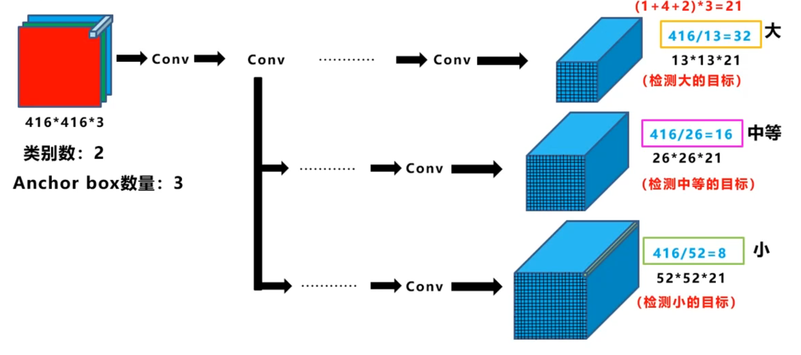
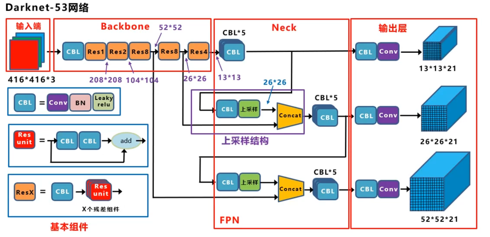
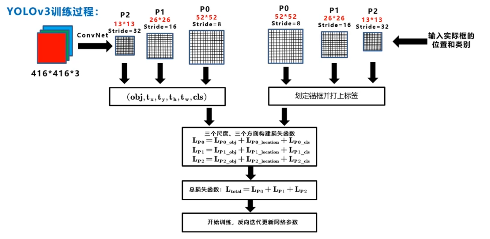
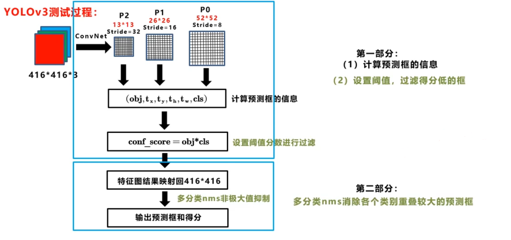

# YOLOv3 原理详解

---

## 一、YOLO算法设计思路

### 1. 目标检测和分类的区别

#### 1.1 图像分类任务

图像分类的目标是判断整张图像属于哪个类别，输出一个类别标签：

$$
\text{输出}: \text{class} \in \{1,\dots,C\}
$$

例如：输入一张猫的图片，输出"猫"这个类别。

**特点**：
- 输入：一张完整图像
- 输出：单个类别标签（或类别概率分布）
- 任务：判断图像整体内容
- 网络结构：通常以全连接层结束，输出 $C$ 维向量

#### 1.2 目标检测任务

目标检测不仅要识别图像中有哪些物体，还要定位它们的位置。对每个目标，需要输出：

$$
\text{输出}: \{(b_x, b_y, b_w, b_h, \text{confidence}, \text{class})\}_{k=1}^N
$$

**关键区别**：

| 维度 | 图像分类 | 目标检测 |
|------|---------|---------|
| 任务复杂度 | 简单：整图一个标签 | 复杂：多个目标+位置 |
| 输出内容 | 类别概率 | 边界框+类别+置信度 |
| 输出数量 | 固定（C个类别） | 不固定（N个目标） |
| 空间信息 | 不需要 | 必须保留 |
| 网络输出 | FC层输出类别 | 卷积输出空间特征图 |

#### 1.3 YOLO的核心创新

传统目标检测（如R-CNN系列）采用"两阶段"方法：
1. 第一阶段：生成候选区域（Region Proposal）
2. 第二阶段：对每个候选区域分类和回归

**YOLO的创新**：**将目标检测转化为回归问题**

- 将图像划分为 $S\times S$ 网格
- 每个网格直接预测边界框和类别
- **一次前向传播**完成检测，实现实时性

符号解释：

| 符号 | 含义 |
|------|------|
| $C$ | 类别数（如COCO数据集80类） |
| $N$ | 图像中目标数量（不固定） |
| $b_x,b_y$ | 边界框中心坐标 |
| $b_w,b_h$ | 边界框宽度和高度 |
| $\text{confidence}$ | 目标置信度 |

---

### 2. 每个格子的目标标签构成

#### 2.1 网格划分机制

YOLOv3将输入图像（如 $416\times416$）通过卷积神经网络映射到不同尺度的特征图：

- **大尺度特征图**：$52\times52$（步长stride=8）→ 检测小目标
- **中尺度特征图**：$26\times26$（步长stride=16）→ 检测中等目标
- **小尺度特征图**：$13\times13$（步长stride=32）→ 检测大目标

每个特征图的每个网格单元都负责预测**该网格区域内**的目标。

#### 2.2 标签张量结构

对于每个尺度的特征图，输出张量维度为：

$$
\text{输出维度} = S \times S \times [B \times (5 + C)]
$$

其中：
- $S\times S$：特征图的网格数量
- $B$：每个网格的anchor数量（YOLOv3中 $B=3$）
- $5$：边界框参数（$b_x, b_y, b_w, b_h$）+ 置信度（$\text{objectness}$）
- $C$：类别数

**单个anchor的标签向量**：

$$
t = [b_x, b_y, b_w, b_h, \text{objectness}, c_1, c_2, \dots, c_C]
$$

例如，COCO数据集（80类），每个anchor的标签维度为 $5+80=85$。

#### 2.3 标签参数详细计算

假设真实目标框的属性为：
- 中心坐标：$(x_{gt}, y_{gt})$（相对于原图，单位：像素）
- 宽高：$(w_{gt}, h_{gt})$（相对于原图，单位：像素）
- 输入图像尺寸：$W \times H$（如 $416\times416$）
- 当前特征图尺度：$S\times S$（如 $13\times13$）
- 步长：$\text{stride} = \frac{W}{S}$（如 $\frac{416}{13}=32$）

##### **步骤1：确定目标所属的网格**

目标中心对应的网格索引：

$$
c_x = \lfloor \frac{x_{gt}}{\text{stride}} \rfloor, \quad c_y = \lfloor \frac{y_{gt}}{\text{stride}} \rfloor
$$

例如：目标中心在 $(200, 150)$，步长为32，则：
$$
c_x = \lfloor \frac{200}{32} \rfloor = 6, \quad c_y = \lfloor \frac{150}{32} \rfloor = 4
$$

目标被分配到网格 $(6, 4)$。

##### **步骤2：计算网格内的相对偏移量 $b_x, b_y$**

$$
b_x = \frac{x_{gt}}{\text{stride}} - c_x, \quad b_y = \frac{y_{gt}}{\text{stride}} - c_y
$$

**取值范围**：$b_x, b_y \in [0, 1)$

继续上例：
$$
b_x = \frac{200}{32} - 6 = 6.25 - 6 = 0.25
$$
$$
b_y = \frac{150}{32} - 4 = 4.6875 - 4 = 0.6875
$$

**物理意义**：目标中心相对于网格左上角的偏移比例。

##### **步骤3：计算归一化的宽高 $b_w, b_h$**

$$
b_w = \frac{w_{gt}}{W}, \quad b_h = \frac{h_{gt}}{H}
$$

例如：目标框宽高为 $(80, 120)$，图像尺寸 $416\times416$：
$$
b_w = \frac{80}{416} \approx 0.192, \quad b_h = \frac{120}{416} \approx 0.288
$$

**注意**：这里的归一化是相对于**原图尺寸**，不是网格尺寸。

##### **步骤4：确定置信度和类别**

- **Objectness（物体置信度）**：
  - 如果该anchor负责这个目标，则 $\text{objectness} = 1$
  - 否则 $\text{objectness} = 0$

- **类别标签 $c_1, c_2, \dots, c_C$**：
  - 采用**one-hot编码**或**多标签编码**
  - 如果目标是"狗"（假设是第5类），则 $c_5=1$，其余为0

#### 2.4 完整标签示例

假设在 $13\times13$ 特征图的网格 $(6,4)$ 中，有一个"狗"目标（类别5），三个anchor中的第2个anchor负责：

```
Anchor 0: [0, 0, 0, 0, 0,  0,0,0,...,0]  (无目标)
Anchor 1: [0.25, 0.6875, 0.192, 0.288, 1,  0,0,0,0,1,0,...,0]  (负责"狗")
Anchor 2: [0, 0, 0, 0, 0,  0,0,0,...,0]  (无目标)
```

**为什么是第2个anchor负责？** → 见下节"锚框匹配机制"

---

### 3. 多目标场景与锚框（Anchor Box）机制

#### 3.1 为什么需要引入锚框？

##### **问题背景**

在YOLOv1中，每个网格只能预测**一个目标**，存在以下问题：

1. **多目标冲突**：如果多个目标的中心落在同一个网格，只能检测其中一个
2. **尺度不敏感**：无法针对不同尺度和长宽比的目标进行优化

**例子**：一群小鸟飞过，多个鸟的中心可能落在同一个网格，YOLOv1只能检测到一只。

##### **解决方案：引入Anchor Box**

每个网格不再只预测一个目标框，而是预测**多个不同形状的候选框**（anchors），每个anchor负责特定尺度和长宽比的目标。

$$
\text{网格输出} = B \times (5+C)
$$

YOLOv3中 $B=3$，即每个网格预测3个不同形状的anchor。

#### 3.2 锚框与真实目标的匹配机制

##### **匹配原则**

对于每个真实目标框 $B_{gt}$，需要从所有anchor中选择**一个**最匹配的anchor负责预测它。

**匹配策略**：计算真实框与每个anchor的IoU（交并比），选择IoU最大的anchor：

$$
k^* = \arg\max_{k \in \{1,2,3\}} \text{IoU}(B_{gt}, A_k)
$$

**关键点**：
- IoU计算时，**将真实框和anchor的中心都设为同一点**（通常是网格中心）
- 只比较形状（宽高比），不考虑位置偏移
- 一个真实框只匹配一个anchor，但一个anchor可以匹配多个真实框（对于一张图，其每一个网格都有设定的三个锚框）

##### **IoU计算**

对于两个框 $A$ 和 $B$：

$$
\text{IoU}(A, B) = \frac{\text{Area}(A \cap B)}{\text{Area}(A \cup B)}
$$

当中心对齐时，简化为：

$$
\text{IoU}(A, B) = \frac{\min(w_A, w_B) \times \min(h_A, h_B)}{\max(w_A, w_B) \times \max(h_A, h_B)}
$$

##### **匹配示例**

假设三个anchor的尺寸（归一化）：
- Anchor 0: $(0.1, 0.2)$ → 窄长形，适合人
- Anchor 1: $(0.2, 0.2)$ → 正方形，适合车
- Anchor 2: $(0.3, 0.1)$ → 宽扁形，适合巴士

真实目标"汽车"：宽高 $(0.18, 0.19)$

计算IoU：
- $\text{IoU}(car, A_0) = 0.45$
- $\text{IoU}(car, A_1) = 0.89$ ✓ **最大**
- $\text{IoU}(car, A_2) = 0.52$

因此Anchor 1负责预测这辆车。

#### 3.3 多目标在同一网格的处理

**场景**：两个不同类别的目标中心都落在网格 $(i, j)$

**处理方式**：

1. 分别为两个目标找到最匹配的anchor（可能是不同的anchor）
2. 每个anchor独立预测一个目标
3. 如果两个目标匹配到同一个anchor → **只能检测一个**（YOLOv3的局限）

**标签示例**（假设"人"和"自行车"都在同一网格）：

```
Anchor 0 (窄长): [b_x1, b_y1, b_w1, b_h1, 1,  1,0,0,...] (人)
Anchor 1 (正方): [0, 0, 0, 0, 0,  0,0,0,...]      (无目标)
Anchor 2 (宽扁): [b_x2, b_y2, b_w2, b_h2, 1,  0,1,0,...] (自行车)
```

#### 3.4 锚框形状的确定：K-means聚类

##### **问题**：如何设计anchor的尺寸？

人工设计anchor尺寸不够精确，YOLOv3采用**K-means聚类算法**从训练数据中自动学习anchor尺寸。

##### **聚类方法**

1. **输入**：训练集中所有真实框的宽高 $\{(w_i, h_i)\}_{i=1}^M$

2. **距离度量**：不使用欧氏距离，而是使用**基于IoU的距离**：

$$
d(B, C) = 1 - \text{IoU}(B, C)
$$

**原因**：欧氏距离对大框更敏感，IoU距离更关注形状相似性。

3. **聚类目标**：最小化平均距离

$$
\min \sum_{i=1}^M d(B_i, C_{k_i})
$$

其中 $C_{k_i}$ 是框 $B_i$ 最近的聚类中心。

4. **聚类数量**：YOLOv3使用 $K=9$ 个anchor（每个尺度3个）

##### **COCO数据集的anchor示例**

经过K-means聚类，YOLOv3在COCO数据集上得到的9个anchor（相对于 $416\times416$ 输入）：

**小尺度特征图（$13\times13$，stride=32）**：
- $(116, 90)$, $(156, 198)$, $(373, 326)$ → 大目标

**中尺度特征图（$26\times26$，stride=16）**：
- $(30, 61)$, $(62, 45)$, $(59, 119)$ → 中等目标

**大尺度特征图（$52\times52$，stride=8）**：
- $(10, 13)$, $(16, 30)$, $(33, 23)$ → 小目标

## 二、yolo检测算法细节

### 1. 多尺度特征融合（Multi-Scale Feature Fusion）

#### 1.1 什么是多尺度特征融合？

多尺度特征融合是指**将不同分辨率的特征图进行组合**，使每个检测层都能同时利用：
- **浅层特征**：高分辨率，包含细节信息（边缘、纹理）
- **深层特征**：低分辨率，包含语义信息（物体类别、上下文）

YOLOv3在三个不同尺度的特征图上进行检测：
- $52\times52$ ：大特征图，小感受野 → 检测**小目标**
- $26\times26$ ：中特征图，中感受野 → 检测**中等目标**
- $13\times13$ ：小特征图，大感受野 → 检测**大目标**

#### 1.2 为什么需要多尺度特征融合？

##### **问题1：单尺度的局限性**

如果只使用最后一层的特征图（$13\times13$）：
- **优点**：语义信息丰富，适合识别大目标
- **缺点**：分辨率低，小目标的特征已经丢失（如远处的行人）

**示例**：
- 大目标"汽车"在 $13\times13$ 特征图上可能占据 $3\times3$ 个网格 ✓
- 小目标"行人"在 $13\times13$ 特征图上可能不到 $1\times1$ 个网格 ✗

##### **问题2：目标尺度变化大**

在实际场景中，同一类别的目标尺度差异很大：
- 近处的车：占据图像的30%
- 远处的车：只占据图像的1%

单一尺度的特征图无法同时处理这两种情况。

##### **解决方案：多尺度检测**

在不同深度的特征图上分别检测：
- **浅层特征图**（$52\times52$）：分辨率高，保留小目标的细节
- **深层特征图**（$13\times13$）：语义强，适合大目标识别

#### 1.3 每个尺度特征图的作用

| 特征图尺度 | 输出维度 | Stride | 感受野 | 适合目标 | 原因 |
|-----------|---------|--------|--------|---------|------|
| $52\times52$ | $52\times52\times255$ | 8 | 小 | 小目标（如鸟、远处的人） | 高分辨率保留细节，小stride捕捉精细位置 |
| $26\times26$ | $26\times26\times255$ | 16 | 中 | 中等目标（如人、自行车） | 平衡分辨率和语义，适合常见尺度 |
| $13\times13$ | $13\times13\times255$ | 32 | 大 | 大目标（如车、巴士） | 大感受野包含全局上下文，语义信息充分 |

**输出维度说明**（以COCO 80类为例）：
$$
\text{通道数} = 3 \times (5 + 80) = 255
$$
- 3：每个网格3个anchor
- 5：$b_x, b_y, b_w, b_h, \text{objectness}$
- 80：80个类别的概率

##### **为什么大特征图检测小目标？**

**关键原因**：stride小，位置精度高

- $52\times52$ 特征图的stride=8，即原图每8个像素对应特征图1个像素
- 一个 $24\times24$ 像素的小目标在 $52\times52$ 特征图上占据 $3\times3$ 个网格 ✓
- 同样目标在 $13\times13$ 特征图上只占据不到 $1\times1$ 个网格 ✗

**语义vs分辨率的权衡**：
- 小目标：形状简单，不需要太强的语义，**更需要高分辨率定位**
- 大目标：形状复杂，**更需要深层语义**来理解物体整体

#### 1.4 特征融合的具体机制（FPN结构）



YOLOv3借鉴了**FPN（Feature Pyramid Network）**的思想，采用**自顶向下的特征融合**。

##### **主干网络Darknet-53的输出**

| 层级 | 输出特征图 | 维度 | 名称 |
|------|-----------|------|------|
| 深层 | $13\times13$ | $13\times13\times1024$ | C5 |
| 中层 | $26\times26$ | $26\times26\times512$ | C4 |
| 浅层 | $52\times52$ | $52\times52\times256$ | C3 |

##### **融合过程（自顶向下）**

**第一步：处理C5（最深层）**
```
C5 (13×13×1024)
   ↓ 1×1 卷积降维
   (13×13×512)
   ↓ 上采样×2
   (26×26×512)
```

**第二步：融合C4**
```
上采样的C5 (26×26×512) ⊕ C4 (26×26×512)
   ↓ Concatenate
   (26×26×1024)
   ↓ 卷积处理
P4 (26×26×512)
   ↓ 1×1 卷积降维
   (26×26×256)
   ↓ 上采样×2
   (52×52×256)
```

**第三步：融合C3**
```
上采样的P4 (52×52×256) ⊕ C3 (52×52×256)
   ↓ Concatenate
   (52×52×512)
   ↓ 卷积处理
P3 (52×52×256)
```

##### **最终检测输出**

```
P5 (13×13) → 检测层1 → 输出 (13×13×255) → 大目标
P4 (26×26) → 检测层2 → 输出 (26×26×255) → 中目标
P3 (52×52) → 检测层3 → 输出 (52×52×255) → 小目标
```

##### **融合的数学表示**

自顶向下的融合可表示为：

$$
P_i = \text{Conv}(\text{Concat}(C_i, \text{Upsample}(P_{i+1})))
$$

其中：
- $\text{Upsample}$：上采样（通常用最近邻或双线性插值）
- $\text{Concat}$：通道拼接
- $\text{Conv}$：卷积处理融合后的特征

**作用**：
- 深层特征通过上采样恢复分辨率
- 与浅层特征拼接后，同时具有**语义信息**和**位置信息**

---

### 2. 图像尺寸不统一的处理：自适应缩放

#### 2.1 为什么需要处理尺寸不统一？

实际应用中，输入图像的尺寸千差万别：
- 高清图：$1920\times1080$
- 手机图：$1080\times1920$（竖屏）
- 正方形：$800\times800$

但神经网络要求**固定尺寸输入**（如 $416\times416$）。

#### 2.2 常见的缩放策略

##### **策略1：直接拉伸（Resize）**
```
原图 (1920×1080) → 强制缩放 → (416×416)
```
**缺点**：改变长宽比，导致物体变形，影响检测精度

##### **策略2：裁剪（Crop）**
```
原图 (1920×1080) → 中心裁剪 (1080×1080) → 缩放 → (416×416)
```
**缺点**：丢失边缘区域的目标

##### **策略3：填充（Padding）** ✓ **YOLOv3采用**

**步骤**：
1. 计算缩放比例，保持长宽比
2. 缩放到目标尺寸内
3. 用灰色或黑色填充剩余区域

#### 2.3 YOLOv3的等比例缩放算法

##### **算法流程**

输入：原图尺寸 $(W_{orig}, H_{orig})$，目标尺寸 $(W_{target}, H_{target})$

**步骤1：计算缩放比例**

$$
\text{scale} = \min\left(\frac{W_{target}}{W_{orig}}, \frac{H_{target}}{H_{orig}}\right)
$$

选择最小比例，确保缩放后**不超出目标尺寸**。

**步骤2：计算缩放后的尺寸**

$$
W_{new} = \lfloor W_{orig} \times \text{scale} \rfloor
$$
$$
H_{new} = \lfloor H_{orig} \times \text{scale} \rfloor
$$

**步骤3：计算填充量**

$$
\Delta W = W_{target} - W_{new}
$$
$$
\Delta H = H_{target} - H_{new}
$$

通常采用**居中填充**：
$$
\text{pad\_left} = \lfloor \Delta W / 2 \rfloor, \quad \text{pad\_right} = \Delta W - \text{pad\_left}
$$
$$
\text{pad\_top} = \lfloor \Delta H / 2 \rfloor, \quad \text{pad\_bottom} = \Delta H - \text{pad\_top}
$$

##### **示例计算**

原图：$1920\times1080$，目标：$416\times416$

$$
\text{scale} = \min\left(\frac{416}{1920}, \frac{416}{1080}\right) = \min(0.217, 0.385) = 0.217
$$

$$
W_{new} = \lfloor 1920 \times 0.217 \rfloor = 416
$$
$$
H_{new} = \lfloor 1080 \times 0.217 \rfloor = 234
$$

$$
\Delta H = 416 - 234 = 182
$$
$$
\text{pad\_top} = \lfloor 182/2 \rfloor = 91, \quad \text{pad\_bottom} = 91
$$

最终图像：上下各填充91像素的灰色带。

#### 2.4 对真实框标注的影响

缩放和填充后，需要**同步调整真实框坐标**。

假设原图中真实框 $(x, y, w, h)$，调整后：

$$
x' = x \times \text{scale} + \text{pad\_left}
$$
$$
y' = y \times \text{scale} + \text{pad\_top}
$$
$$
w' = w \times \text{scale}
$$
$$
h' = h \times \text{scale}
$$

---

### 3. 预测框的计算机制

#### 3.1 网络输出与预测框的关系

网络**不直接输出** $b_x, b_y, b_w, b_h$，而是输出**偏移量** $t_x, t_y, t_w, t_h$。

**原因**：
1. 直接回归绝对坐标难以优化（值域大，不稳定）
2. 偏移量相对于anchor和网格，更容易学习（值域小，有参考）

#### 3.2 四参数 $t_x, t_y, t_w, t_h$ 的物理意义

| 参数 | 含义 | 值域 |
|------|------|------|
| $t_x$ | 中心x方向相对于网格的偏移 | $(-\infty, +\infty)$ |
| $t_y$ | 中心y方向相对于网格的偏移 | $(-\infty, +\infty)$ |
| $t_w$ | 宽度相对于anchor的对数缩放 | $(-\infty, +\infty)$ |
| $t_h$ | 高度相对于anchor的对数缩放 | $(-\infty, +\infty)$ |

#### 3.3 从 $(t_x, t_y, t_w, t_h)$ 计算预测框 $(b_x, b_y, b_w, b_h)$

##### **中心坐标计算**

$$
b_x = \sigma(t_x) + c_x
$$
$$
b_y = \sigma(t_y) + c_y
$$

**符号说明**：
- $\sigma(t) = \frac{1}{1+e^{-t}}$：Sigmoid函数，将 $t$ 映射到 $(0,1)$
- $c_x, c_y$：网格的左上角坐标（整数）
- $b_x, b_y$：预测框中心在特征图上的坐标

**设计原理**：
- $\sigma(t_x) \in (0, 1)$：确保预测框中心**不会超出当前网格**
- $c_x + \sigma(t_x)$：中心坐标 = 网格坐标 + 网格内偏移

**示例**：
- 网格 $(5, 3)$，即 $c_x=5, c_y=3$
- 网络输出 $t_x=1.5, t_y=-0.8$
- 计算：
  $$
  \sigma(1.5) = \frac{1}{1+e^{-1.5}} \approx 0.818
  $$
  $$
  b_x = 0.818 + 5 = 5.818
  $$
  $$
  \sigma(-0.8) \approx 0.310, \quad b_y = 0.310 + 3 = 3.310
  $$

##### **宽高计算**

$$
b_w = a_w \cdot e^{t_w}
$$
$$
b_h = a_h \cdot e^{t_h}
$$

**符号说明**：
- $a_w, a_h$：anchor的宽高（预定义）
- $e^{t_w}, e^{t_h}$：指数形式的缩放因子

**设计原理**：
- 使用**对数空间**：$\log(b_w) = \log(a_w) + t_w$
- $t_w > 0$：预测框比anchor宽
- $t_w < 0$：预测框比anchor窄
- 对数形式确保 $b_w, b_h > 0$（宽高必须为正）

**示例**：
- Anchor尺寸：$a_w=1.5, a_h=2.0$（归一化单位）
- 网络输出：$t_w=0.3, t_h=-0.5$
- 计算：
  $$
  b_w = 1.5 \times e^{0.3} = 1.5 \times 1.35 \approx 2.02
  $$
  $$
  b_h = 2.0 \times e^{-0.5} = 2.0 \times 0.606 \approx 1.21
  $$

#### 3.4 转换到原图坐标

特征图坐标 $(b_x, b_y, b_w, b_h)$ 需要映射回原图：

$$
x_{img} = b_x \times \text{stride}
$$
$$
y_{img} = b_y \times \text{stride}
$$
$$
w_{img} = b_w \times W_{img}
$$
$$
h_{img} = b_h \times H_{img}
$$

其中：
- $\text{stride}$：特征图的步长（8/16/32）
- $W_{img}, H_{img}$：原图尺寸

**完整示例**：
- 特征图：$13\times13$，stride=32
- 预测框：$b_x=5.818, b_y=3.310, b_w=0.192, b_h=0.288$
- 原图尺寸：$416\times416$

$$
x_{img} = 5.818 \times 32 = 186.2
$$
$$
y_{img} = 3.310 \times 32 = 105.9
$$
$$
w_{img} = 0.192 \times 416 = 79.9
$$
$$
h_{img} = 0.288 \times 416 = 119.8
$$

最终预测框（原图坐标）：中心 $(186, 106)$，宽高 $(80, 120)$

---

### 4. 锚框的对应机制：一框一责

#### 4.1 核心原则

**一个真实框只对应一个anchor，只调整一个预测框。**

这个设计有以下好处：
1. **明确责任**：避免多个anchor竞争同一目标，减少冗余
2. **稳定训练**：每个anchor专注学习特定尺度/形状的目标
3. **高效计算**：减少不必要的梯度计算

#### 4.2 对应机制详解

##### **训练阶段**

对于每个真实框 $B_{gt}$：

1. **确定所属网格**：根据中心坐标计算 $(c_x, c_y)$
2. **计算IoU**：与该网格的所有anchor计算IoU（中心对齐）
3. **选择最佳anchor**：
   $$
   k^* = \arg\max_k \text{IoU}(B_{gt}, A_k)
   $$
4. **标记正样本**：只有anchor $k^*$ 被标记为**正样本**，其余为**负样本**

##### **正样本和负样本的标签**

**正样本**（负责预测的anchor）：
$$
\text{Label} = [b_x, b_y, b_w, b_h, 1, c_1, \dots, c_C]
$$
- Objectness = 1
- 包含真实的边界框和类别

**负样本**（不负责的anchor）：
$$
\text{Label} = [0, 0, 0, 0, 0, 0, \dots, 0]
$$
- Objectness = 0
- 其他参数无意义（不计算损失）

##### **忽略样本**

YOLOv3引入**忽略机制**：如果某个负样本anchor与真实框的IoU > 阈值（如0.5），将其标记为**忽略样本**，不参与损失计算。

**原因**：这些anchor虽然不是最佳匹配，但预测质量也不差，惩罚它们会干扰训练。

#### 4.3 示例：多目标场景

假设网格 $(6, 4)$ 中有两个真实框：
- **目标1**："人"，尺寸 $(0.1, 0.3)$
- **目标2**："自行车"，尺寸 $(0.25, 0.20)$

三个anchor：
- Anchor 0: $(0.08, 0.35)$ → 窄长形
- Anchor 1: $(0.2, 0.2)$ → 正方形
- Anchor 2: $(0.3, 0.15)$ → 宽扁形

**匹配过程**：

**目标1"人"**：
- $\text{IoU}(人, A_0) = 0.78$ ✓ **最大**
- $\text{IoU}(人, A_1) = 0.42$
- $\text{IoU}(人, A_2) = 0.25$
- **结论**：Anchor 0 负责预测"人"

**目标2"自行车"**：
- $\text{IoU}(自行车, A_0) = 0.31$
- $\text{IoU}(自行车, A_1) = 0.85$ ✓ **最大**
- $\text{IoU}(自行车, A_2) = 0.68$
- **结论**：Anchor 1 负责预测"自行车"

**最终标签**：
```
Anchor 0: [b_x1, b_y1, b_w1, b_h1, 1, 1,0,0,...] (人)
Anchor 1: [b_x2, b_y2, b_w2, b_h2, 1, 0,1,0,...] (自行车)
Anchor 2: [0, 0, 0, 0, 0, 0,0,0,...]           (负样本)
```

注意：Anchor 2虽然与"自行车"的IoU=0.68（较高），但因为不是最佳匹配，所以是负样本。如果IoU > 0.5，会被标记为**忽略样本**，不参与损失计算。

---

## 三、YOLO网络结构



### 1. 主干网络Darknet-53

#### 1.1 为什么叫Darknet-53？

**命名由来**：

- **Darknet**：YOLOv3使用的深度学习框架名称
- **53**：网络共有**53层卷积层**（不包括全连接层，因为YOLO是全卷积网络）
- **卷积层**：一个卷积层CBL实际包括了卷积层Conv，批量归一化BN（Batch Normalization）和激活函数LeakyReLU

**设计特点**：
- 全卷积结构，无全连接层
- 采用残差连接（Residual Connection）
- 步长为2的卷积代替池化层

#### 1.2 Darknet-53的层级结构

Darknet-53分为6个阶段（Stage），逐步降低分辨率、增加通道数：

| Stage | 输入尺寸 | 操作 | 输出尺寸 | 残差块数 | 累计卷积层 |
|-------|---------|------|---------|---------|-----------|
| 0 | $416\times416\times3$ | Conv 3×3, 32 | $416\times416\times32$ | 0 | 1 |
| 1 | $416\times416\times32$ | Conv 3×3, 64, /2 | $208\times208\times64$ | 1 | 4 |
| 2 | $208\times208\times64$ | Conv 3×3, 128, /2 | $104\times104\times128$ | 2 | 9 |
| 3 | $104\times104\times128$ | Conv 3×3, 256, /2 | $52\times52\times256$ | 8 | 26 |
| 4 | $52\times52\times256$ | Conv 3×3, 512, /2 | $26\times26\times512$ | 8 | 43 |
| 5 | $26\times26\times512$ | Conv 3×3, 1024, /2 | $13\times13\times1024$ | 4 | 52 |
| 输出层 | $13\times13\times1024$ | Global Avg Pool + FC | - | - | 53 |

**符号说明**：
- `/2`：stride=2，尺寸减半
- **残差块数**：每个Stage包含的残差模块数量，**其中每个残差块内也包含两个卷积层**

**关键设计**：
- 使用stride=2的卷积**代替池化层**，保留更多信息
- 深层网络（53层）提取丰富的特征
- 多尺度输出：Stage 3/4/5的输出分别用于多尺度检测

#### 1.3 逐层详细结构

##### **Stage 0：初始卷积**

| 层数 | 操作 | 核大小 | Stride | Padding | 输出 |
|------|------|--------|--------|---------|------|
| 1 | Conv + BN + LeakyReLU | 3×3 | 1 | 1 | $416\times416\times32$ |

**作用**：初步提取图像特征，增加通道数。

##### **Stage 1：第一次下采样**

| 层数 | 操作 | 核大小 | Stride | 输出 |
|------|------|--------|--------|------|
| 2 | Conv + BN + LeakyReLU | 3×3 | 2 | $208\times208\times64$ |
| 3-4 | Residual Block ×1 | - | - | $208\times208\times64$ |

**Residual Block结构**（后续所有Stage都采用）：
```
输入 (H×W×C)
  ↓
  Conv 1×1, C/2 (降维)
  ↓
  Conv 3×3, C (恢复维度)
  ↓
  ⊕ (Add，残差连接)
  ↓
输出 (H×W×C)
```

##### **Stage 2-5：深度特征提取**

各Stage的残差块数量：
- Stage 2：2个残差块
- Stage 3：**8个残差块**（输出C3，用于检测小目标）
- Stage 4：**8个残差块**（输出C4，用于检测中等目标）
- Stage 5：**4个残差块**（输出C5，用于检测大目标）

**总计卷积层数**：

- 最开始1个
- 五次步长为2的降维：5个
- 23个残差块：2*23=46个
- 最后全连接层：1个

$$
1 + 5 + 2 \times (1 + 2 + 8 + 8 + 4) = 1 + 1 + 2 \times 23 + 1 = 1 + 5 + 46 + 1 = 53 \, \text{层（主干）}
$$

#### 1.4 为什么用Darknet-53？

##### **对比其他主干网络**

| 主干网络 | 参数量 | 精度(mAP) | 速度(FPS) | 优缺点 |
|---------|--------|----------|----------|--------|
| ResNet-101 | 44.5M | 77.1% | 53 | 精度高，但速度慢 |
| ResNet-152 | 60.2M | 77.6% | 37 | 精度略高，速度更慢 |
| **Darknet-53** | **41.6M** | **77.2%** | **78** | 平衡精度和速度 ✓ |
| Darknet-19 | 20.8M | 72.9% | 171 | 速度快，精度不足 |

**Darknet-53的优势**：
1. **速度快**：比ResNet-101快47%（78 vs 53 FPS）
2. **精度相当**：与ResNet-101相近（77.2% vs 77.1%）
3. **深度适中**：53层足够提取复杂特征，又不至于过深导致速度慢

---

### 2. 残差网络模型（Residual Network）

#### 2.1 什么是残差连接？

残差连接（Residual Connection）是ResNet提出的核心创新，用于解决**深层网络的退化问题**。

##### **深层网络的退化问题**

理论上，网络越深，表达能力越强。但实验发现：
- 网络超过20层后，训练精度反而**下降**
- 原因：梯度消失/爆炸，导致深层网络难以优化

##### **残差连接的解决方案**

传统网络学习的是**映射函数** $H(x)$：
$$
\text{输出} = H(x)
$$

残差网络学习的是**残差函数** $F(x)$：
$$
\text{输出} = F(x) + x
$$

其中 $F(x) = H(x) - x$。

**优势**：
1. **恒等映射更容易学习**：如果最优解是 $H(x)=x$，残差网络只需将 $F(x)$ 学习为0即可
2. **梯度直通**：梯度可以通过加法直接传递到浅层，缓解梯度消失

#### 2.2 Darknet-53中的残差块

##### **残差块结构**

```
输入: (H, W, C)
   ↓
   ┌─────────────────┐  (短路连接)
   │                 │
   ↓                 │
Conv 1×1, C/2        │
BN + LeakyReLU       │
   ↓                 │
Conv 3×3, C          │
BN + LeakyReLU       │
   ↓                 │
   ⊕ ←───────────────┘  (逐元素相加)
   ↓
输出: (H, W, C)
```

**数学表达**：
$$
y = F(x, \{W_i\}) + x
$$

其中 $F(x, \{W_i\})$ 表示两层卷积操作。

##### **1×1卷积的作用**

第一层使用1×1卷积降维（$C \to C/2$）的好处：
1. **减少计算量**：3×3卷积在较少通道上进行，参数量减少
2. **瓶颈结构**（Bottleneck）：先压缩再恢复，类似自编码器

**参数量对比**：
- 不降维：$C \times C \times 3 \times 3 = 9C^2$
- 降维：$C \times (C/2) \times 1 \times 1 + (C/2) \times C \times 3 \times 3 = 5C^2$

降维后参数量减少约44%。

#### 2.3 残差连接的数学原理

##### **反向传播中的梯度传递**

对于残差块 $y = F(x) + x$，损失函数 $L$ 对 $x$ 的梯度为：

$$
\frac{\partial L}{\partial x} = \frac{\partial L}{\partial y} \cdot \frac{\partial y}{\partial x} = \frac{\partial L}{\partial y} \cdot \left( \frac{\partial F(x)}{\partial x} + 1 \right)
$$

**关键点**：梯度中包含**常数项1**，确保梯度至少能完整传递回去，避免梯度消失。

传统网络的梯度：
$$
\frac{\partial L}{\partial x} = \frac{\partial L}{\partial y} \cdot \frac{\partial F(x)}{\partial x}
$$

如果 $\frac{\partial F(x)}{\partial x}$ 很小，梯度会快速衰减。

##### **残差学习的直观理解**

假设当前层已经学得较好，最优输出应该接近输入 $x$，即 $H(x) \approx x$。

- **传统网络**：需要学习复杂的恒等映射 $H(x) = x$
- **残差网络**：只需学习 $F(x) = 0$（零映射），更容易优化

---

### 3. Neck层：多尺度特征融合

#### 3.1 Neck层的作用

Neck层位于**主干网络（Backbone）和检测头（Head）之间**，负责：
1. **特征融合**：结合不同尺度的特征图
2. **特征增强**：通过上采样和拼接增强特征表达
3. **多尺度输出**：生成3个不同尺度的特征图供检测使用

#### 3.2 Neck层的具体结构

##### **输入**

从Darknet-53提取三个尺度的特征图：
- **C3**：$52\times52\times256$（Stage 3输出）
- **C4**：$26\times26\times512$（Stage 4输出）
- **C5**：$13\times13\times1024$（Stage 5输出）

##### **融合流程**

**步骤1：处理C5（深层特征）**

```
C5 (13×13×1024)
  ↓
  5× [Conv 1×1 + Conv 3×3] (DBL块)
  ↓
  (13×13×512) → P5 检测层
  ↓
  Conv 1×1, 256 (降维)
  ↓
  Upsample ×2 (最近邻插值)
  ↓
  (26×26×256)
```

**步骤2：融合C4（中层特征）**

```
Upsampled C5 (26×26×256) + C4 (26×26×512)
  ↓
  Concatenate (通道拼接)
  ↓
  (26×26×768)
  ↓
  5× [Conv 1×1 + Conv 3×3] (DBL块)
  ↓
  (26×26×256) → P4 检测层
  ↓
  Conv 1×1, 128 (降维)
  ↓
  Upsample ×2
  ↓
  (52×52×128)
```

**步骤3：融合C3（浅层特征）**

```
Upsampled P4 (52×52×128) + C3 (52×52×256)
  ↓
  Concatenate
  ↓
  (52×52×384)
  ↓
  5× [Conv 1×1 + Conv 3×3] (DBL块)
  ↓
  (52×52×128) → P3 检测层
```

##### **DBL块（Darknet Basic Layer）**

每个DBL块包含5组卷积：
```
Conv 1×1 → Conv 3×3 → Conv 1×1 → Conv 3×3 → Conv 1×1
```

每个卷积后都跟随：
- **BN（Batch Normalization）**：加速训练，稳定梯度
- **LeakyReLU**：激活函数，引入非线性

#### 3.3 为什么采用自顶向下融合？

##### **自顶向下 vs 自底向上**

**自顶向下（YOLOv3采用）**：
- 从深层特征开始，逐步上采样融合浅层特征
- 优点：深层语义信息可以传递到浅层，增强小目标检测的语义理解

**自底向上**：
- 从浅层特征开始，逐步下采样融合深层特征
- 优点：保留更多细节，但语义信息传递困难

**双向融合（BiFPN，EfficientDet采用）**：
- 同时进行自顶向下和自底向上融合
- 优点：最全面的信息交换，但计算量大

YOLOv3选择自顶向下是**速度和精度的平衡**。

#### 3.4 上采样（Upsample）方法

YOLOv3使用**最近邻插值**进行上采样。

##### **最近邻插值原理**

将特征图放大2倍，每个像素复制4次：

```
原始 (2×2):          上采样后 (4×4):
[1  2]              [1  1  2  2]
[3  4]      →       [1  1  2  2]
                    [3  3  4  4]
                    [3  3  4  4]
```

**优点**：
- 计算简单，速度快
- 不引入新的参数

**缺点**：
- 缺少平滑过渡，可能产生块状效应

**其他上采样方法**：
- **双线性插值**：平滑但计算稍慢
- **转置卷积**：可学习，但参数多、易产生棋盘效应

---

## 四、训练过程



### 1. 训练输入

#### 1.1 输入组成

训练YOLOv3需要以下输入：

**图像数据**：
- 输入尺寸：$416\times416\times3$（可调整为320、608等）
- 归一化：像素值缩放到 $[0, 1]$
- 数据增强：随机翻转、旋转、色彩抖动、Mosaic增强等

**标注数据**（每个目标）：
- 边界框：$(x_{center}, y_{center}, width, height)$（归一化到$[0,1]$）
- 类别标签：$c \in \{1, 2, \dots, C\}$

**Anchor参数**：
- 9个anchor尺寸（通过K-means聚类得到）
- 每个尺度3个anchor

#### 1.2 数据增强技术

##### **常用增强方法**

| 增强方法 | 说明 | 作用 |
|---------|------|------|
| 随机翻转 | 水平翻转图像 | 增加样本多样性，提升泛化 |
| 随机裁剪 | 裁剪图像的一部分 | 模拟不同视角 |
| 色彩抖动 | 调整亮度、对比度、饱和度 | 适应不同光照条件 |
| Mosaic | 将4张图像拼接成一张 | 增加小目标数量，丰富场景 |
| MixUp | 混合两张图像 | 提高模型鲁棒性 |

##### **Mosaic增强（YOLOv4/v5引入）**

将4张图像随机缩放后拼接成一张：

```
┌─────────┬─────────┐
│  图像1  │  图像2  │
├─────────┼─────────┤
│  图像3  │  图像4  │
└─────────┴─────────┘
```

**优点**：
1. 一次训练看到4张图像的内容，效率高
2. 小目标数量增加，改善小目标检测
3. 增加背景多样性

---

### 2. 损失函数构成

YOLOv3的总损失函数由三部分组成：

$$
L_{total} = L_{box} + L_{obj} + L_{cls}
$$

#### 2.1 边界框回归损失 $L_{box}$

预测框与真实框的坐标差异，使用**二元交叉熵（BCE）**计算中心坐标，**均方误差（MSE）**计算宽高：

$$
L_{box} = \lambda_{coord} \sum_{i=0}^{S^2} \sum_{j=0}^{B} \mathbb{1}_{ij}^{obj} \left[ L_{xy} + L_{wh} \right]
$$

其中：
- $\mathbb{1}_{ij}^{obj}$：指示函数，第$i$个网格的第$j$个anchor是否负责预测目标（1或0）
- $\lambda_{coord}$：坐标损失权重（通常为5）

##### **中心坐标损失 $L_{xy}$**

$$
L_{xy} = \text{BCE}(\sigma(t_x), b_x) + \text{BCE}(\sigma(t_y), b_y)
$$

二元交叉熵（BCE）：
$$
\text{BCE}(p, \hat{p}) = -\left[ \hat{p} \log(p) + (1-\hat{p}) \log(1-p) \right]
$$

**为什么用BCE？**
- $b_x, b_y \in [0, 1]$，类似二分类问题
- BCE对边界（0或1附近）的预测更敏感，提高定位精度

##### **宽高损失 $L_{wh}$**

$$
L_{wh} = (t_w - \hat{t}_w)^2 + (t_h - \hat{t}_h)^2
$$

其中真实值：
$$
\hat{t}_w = \log\left(\frac{b_w}{a_w}\right), \quad \hat{t}_h = \log\left(\frac{b_h}{a_h}\right)
$$

**为什么用对数空间？**
- 直接回归宽高，大目标的误差会远大于小目标（如100像素vs10像素）
- 对数空间下，相对误差更平衡：$\log(100)-\log(90)$ 与 $\log(10)-\log(9)$ 相近

#### 2.2 目标置信度损失 $L_{obj}$

判断anchor是否包含目标：

$$
L_{obj} = \sum_{i=0}^{S^2} \sum_{j=0}^{B} \left[ \mathbb{1}_{ij}^{obj} \cdot \text{BCE}(\sigma(t_o), 1) + \lambda_{noobj} \cdot \mathbb{1}_{ij}^{noobj} \cdot \text{BCE}(\sigma(t_o), 0) \right]
$$

符号说明：
- $\mathbb{1}_{ij}^{obj}$：正样本（anchor负责目标）
- $\mathbb{1}_{ij}^{noobj}$：负样本（anchor不负责目标，且IoU < 阈值）
- $\lambda_{noobj}$：负样本权重（通常为0.5），降低负样本影响

**为什么需要降权负样本？**
- 负样本数量远多于正样本（如13×13×3=507个anchor，只有几个正样本）
- 不降权会导致模型倾向预测"无目标"，影响召回率

#### 2.3 分类损失 $L_{cls}$

预测目标类别，使用**多标签BCE**（支持多标签分类）：

$$
L_{cls} = \sum_{i=0}^{S^2} \sum_{j=0}^{B} \mathbb{1}_{ij}^{obj} \sum_{c=1}^{C} \text{BCE}(\sigma(t_{c}), \hat{c})
$$

其中：
- $\hat{c} \in \{0, 1\}$：真实类别标签（one-hot）
- $C$：类别数

**为什么用BCE而不是Softmax？**
- Softmax假设类别互斥（每个目标只属于一个类别）
- BCE支持多标签（如"女人"+"人"）
- YOLOv3设计支持多标签场景

#### 2.4 完整损失函数

$$
L_{total} = \lambda_{coord} L_{box} + L_{obj} + \lambda_{cls} L_{cls}
$$

典型超参数：
- $\lambda_{coord} = 5$：坐标损失权重
- $\lambda_{noobj} = 0.5$：负样本权重
- $\lambda_{cls} = 1$：分类损失权重

---

### 3. 反向传播计算

#### 3.1 反向传播流程

**前向传播**：
```
输入图像 → Darknet-53 → Neck融合 → 3个检测头 → 预测 (t_x, t_y, t_w, t_h, t_o, t_c1,...,t_cC)
```

**反向传播**：
```
损失L → ∂L/∂t_o, ∂L/∂t_c → ∂L/∂t_x, ∂L/∂t_y, ∂L/∂t_w, ∂L/∂t_h → 更新网络参数
```

#### 3.2 关键梯度计算

##### **中心坐标的梯度**

对于 $b_x = \sigma(t_x) + c_x$，损失函数 $L$ 对 $t_x$ 的梯度：

$$
\frac{\partial L}{\partial t_x} = \frac{\partial L}{\partial b_x} \cdot \frac{\partial b_x}{\partial t_x} = \frac{\partial L}{\partial b_x} \cdot \sigma(t_x)(1-\sigma(t_x))
$$

其中 $\sigma'(t) = \sigma(t)(1-\sigma(t))$ 是Sigmoid的导数。

##### **宽高的梯度**

对于 $b_w = a_w e^{t_w}$：

$$
\frac{\partial L}{\partial t_w} = \frac{\partial L}{\partial b_w} \cdot \frac{\partial b_w}{\partial t_w} = \frac{\partial L}{\partial b_w} \cdot a_w e^{t_w} = \frac{\partial L}{\partial b_w} \cdot b_w
$$

**注意**：梯度与 $b_w$ 成正比，大目标的梯度更大（这也是为什么要用对数空间平衡）。

#### 3.3 优化器

YOLOv3通常使用**SGD（随机梯度下降）**或**Adam**优化器。

##### **SGD with Momentum**

$$
v_t = \beta v_{t-1} + (1-\beta) \nabla L(\theta_{t-1})
$$
$$
\theta_t = \theta_{t-1} - \alpha v_t
$$

参数：
- 学习率 $\alpha$：初始0.001，余弦退火
- 动量 $\beta$：0.9
- 权重衰减：0.0005

##### **学习率调度**

**Warm-up + Cosine Annealing**：

1. **Warm-up（前1000步）**：
   $$
   \alpha_t = \alpha_{max} \cdot \frac{t}{1000}
   $$
   从0逐渐增加到最大学习率，避免初期不稳定。

2. **Cosine Annealing**：
   $$
   \alpha_t = \alpha_{min} + \frac{1}{2}(\alpha_{max} - \alpha_{min}) \left(1 + \cos\left(\frac{t \pi}{T}\right)\right)
   $$
   学习率按余弦曲线衰减，有助于跳出局部最优。

---

## 五、测试过程（推理）



### 1. 推理流程

#### 1.1 前向传播

```
输入图像 (416×416×3)
   ↓
Darknet-53主干网络
   ↓
Neck特征融合
   ↓
三个检测头
   ├─ P3 (52×52×255) → 小目标
   ├─ P4 (26×26×255) → 中目标
   └─ P5 (13×13×255) → 大目标
   ↓
解码预测框 (t_x, t_y, t_w, t_h, t_o, t_c → b_x, b_y, b_w, b_h, P_obj, P_cls)
```

#### 1.2 预测框解码

对每个anchor的输出 $(t_x, t_y, t_w, t_h, t_o, t_{c1}, \dots, t_{cC})$：

1. **计算坐标**：
   $$
   b_x = (\sigma(t_x) + c_x) \times \text{stride}
   $$
   $$
   b_y = (\sigma(t_y) + c_y) \times \text{stride}
   $$

2. **计算宽高**：
   $$
   b_w = a_w e^{t_w}
   $$
   $$
   b_h = a_h e^{t_h}
   $$

3. **计算置信度**：
   $$
   P_{obj} = \sigma(t_o)
   $$

4. **计算类别概率**：
   $$
   P(c_i) = \sigma(t_{ci})
   $$

5. **计算最终得分**：
   $$
   \text{score}_i = P_{obj} \times P(c_i)
   $$

---

### 2. 后处理：非极大值抑制（NMS）

#### 2.1 为什么需要NMS？

同一个目标可能被**多个anchor预测**：
- 相邻网格的anchor可能都框住同一目标
- 同一网格的不同anchor也可能重复检测

**示例**：
```
一辆车被检测到3个框：
Box1: score=0.92, IoU与真实框=0.85
Box2: score=0.88, IoU与真实框=0.78
Box3: score=0.75, IoU与真实框=0.82
```

需要NMS去除冗余框，只保留最佳的一个。

#### 2.2 NMS算法流程

**输入**：
- 预测框集合 $\{B_1, B_2, \dots, B_N\}$
- 对应得分 $\{s_1, s_2, \dots, s_N\}$
- IoU阈值 $\tau$（通常0.45-0.5）

**算法步骤**：

1. **按得分排序**：将所有预测框按 $\text{score}$ 降序排列
2. **选择最高分框**：选择得分最高的框 $B_{max}$ 作为保留框
3. **计算IoU**：计算 $B_{max}$ 与其余所有框的IoU
4. **抑制重叠框**：删除所有满足 $\text{IoU}(B_{max}, B_i) > \tau$ 的框 $B_i$
5. **迭代**：在剩余框中重复步骤2-4，直到所有框都被处理

**伪代码**：
```python
def NMS(boxes, scores, threshold):
    keep = []
    sorted_indices = argsort(scores, descending=True)
    
    while len(sorted_indices) > 0:
        # 选择得分最高的框
        best_idx = sorted_indices[0]
        keep.append(best_idx)
        
        # 计算IoU
        ious = compute_iou(boxes[best_idx], boxes[sorted_indices[1:]])
        
        # 删除高重叠框
        suppress = ious > threshold
        sorted_indices = sorted_indices[1:][~suppress]
    
    return keep
```

#### 2.3 IoU计算

两个框 $A = (x_A, y_A, w_A, h_A)$ 和 $B = (x_B, y_B, w_B, h_B)$：

**步骤1：计算交集区域**

$$
x_{left} = \max(x_A - w_A/2, x_B - w_B/2)
$$
$$
x_{right} = \min(x_A + w_A/2, x_B + w_B/2)
$$
$$
y_{top} = \max(y_A - h_A/2, y_B - h_B/2)
$$
$$
y_{bottom} = \min(y_A + h_A/2, y_B + h_B/2)
$$

交集宽高：
$$
w_{inter} = \max(0, x_{right} - x_{left})
$$
$$
h_{inter} = \max(0, y_{bottom} - y_{top})
$$

交集面积：
$$
\text{Area}_{inter} = w_{inter} \times h_{inter}
$$

**步骤2：计算并集面积**

$$
\text{Area}_A = w_A \times h_A
$$
$$
\text{Area}_B = w_B \times h_B
$$
$$
\text{Area}_{union} = \text{Area}_A + \text{Area}_B - \text{Area}_{inter}
$$

**步骤3：计算IoU**

$$
\text{IoU}(A, B) = \frac{\text{Area}_{inter}}{\text{Area}_{union}}
$$

#### 2.4 NMS的改进版本

##### **Soft-NMS**

传统NMS直接删除高重叠框，可能误删真实目标（如两个人靠得很近）。

Soft-NMS不删除，而是**降低得分**：

$$
s_i = \begin{cases}
s_i & \text{IoU}(B_{max}, B_i) < \tau \\
s_i \cdot e^{-\frac{\text{IoU}^2(B_{max}, B_i)}{\sigma}} & \text{IoU}(B_{max}, B_i) \geq \tau
\end{cases}
$$

##### **DIoU-NMS**

考虑框的**中心距离**，不仅看重叠度：

$$
\text{DIoU} = \text{IoU} - \frac{d^2(A, B)}{c^2}
$$

其中：
- $d(A, B)$：两框中心距离
- $c$：包含两框的最小外接矩形的对角线长度

---

### 3. 置信度阈值过滤

在NMS之前，通常先用**置信度阈值**过滤低分预测框：

$$
\text{keep} = \{B_i \mid \text{score}_i > \tau_{conf}\}
$$

典型阈值：$\tau_{conf} = 0.25$ 或 0.5

**作用**：
- 减少NMS计算量（去掉大量低分框）
- 提高精度（过滤噪声检测）

---

### 4. 完整推理流程总结

```
输入图像
   ↓
图像预处理（缩放、填充、归一化）
   ↓
网络前向传播
   ↓
三个尺度的检测输出 (13×13, 26×26, 52×52)
   ↓
解码预测框 (t→b, 计算score)
   ↓
置信度阈值过滤 (score > 0.25)
   ↓
NMS去重 (每个类别独立进行)
   ↓
输出最终检测结果 [(x, y, w, h, class, score)]
```

**关键参数**：
- 置信度阈值：0.25（平衡精度和召回率）
- NMS IoU阈值：0.45（防止过度抑制）
- 最大检测数量：300（限制输出框数量）

---

## 六、总结与优化方向

### 1. YOLOv3的优势

1. **实时性**：速度快（30-60 FPS），适合实时应用
2. **多尺度检测**：三个检测层，对不同尺度目标都有较好表现
3. **端到端**：单阶段检测，无需候选区域生成
4. **鲁棒性**：Darknet-53主干网络提取丰富特征

### 2. YOLOv3的局限

1. **小目标聚集**：多个小目标中心在同一网格时，可能漏检
2. **长宽比极端**：对极细长或极扁平的目标效果不佳
3. **定位精度**：相比两阶段方法（Faster R-CNN）定位精度略低
4. **类别不平衡**：负样本远多于正样本，需要仔细调整权重

### 3. 后续改进（YOLOv4/v5/v8）

- **更好的数据增强**：Mosaic、MixUp、CutMix
- **更强的主干网络**：CSPDarknet、EfficientNet
- **更优的Neck**：PANet、BiFPN
- **更好的损失函数**：CIoU Loss、Focal Loss
- **自动超参数搜索**：遗传算法优化anchor等
